# Feature Extraction of ECG Signal for Emotion Detection

## Background 
Affective computing is a study that used for the behavioural analysis of a human. The emotion detection can be done using various biological signals such as Electrocardiogram (ECG), Electroencephalogram (EEG), Electromyogram (EMG). This project focuses on unimodal approach for emotion detection that uses ECG signals for the detection of emotion. Emotion detection follows a signal processing pipeline of methods like pre-processing, feature extraction, feature selection, classification, validation.

### Electrocardiogram (ECG)

An ECG signal is the measure of the electrical activity of the heart in different phases and perspective based on the situation and configuration. The ECG signal is measured using the help of electrodes places on the skin. These electrodes detect the small electrical changes that are a  consequence of cardiac muscle depolarization followed by repolarization during each cardiac cycle (heartbeat).

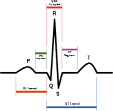

There are three main components to an ECG: the P wave, which represents the  depolarization of the atria; the QRS complex, which represents the depolarization of the ventricles;  and the T wave, which represents the repolarization of the ventricles.

### Emotion Model 
Emotion is a subjective and conscious mental experience accompanied by particular biological responses or changes. To put it in machine-understandable terms, the linear scale of single or multi-dimension axes is used. Affective Dimensional Model (ADM) is a continuous dimensional model meaning two or three axes of linear scales such as valence, arousal and dominance are used.

Valence is the feeling of pleasantness, either being appetitive or aversive, while arousal is the intensity of the feeling being experienced and dominance scale represents the authority to be in control, ranging from submissive to feeling empowered.

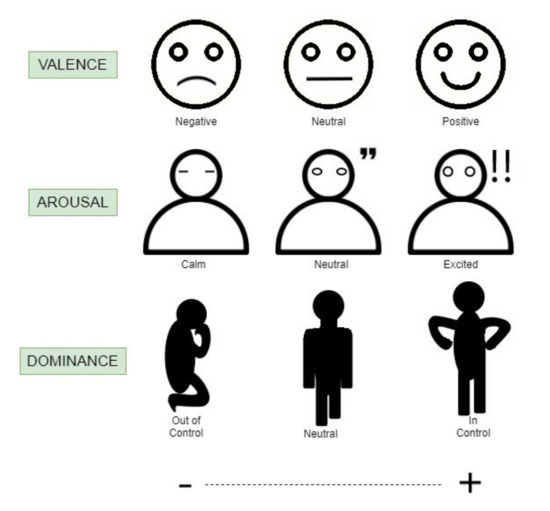

Based on the  valence and arousal scale, the categories of emotions can be segmented depending on the degree of  intensity.

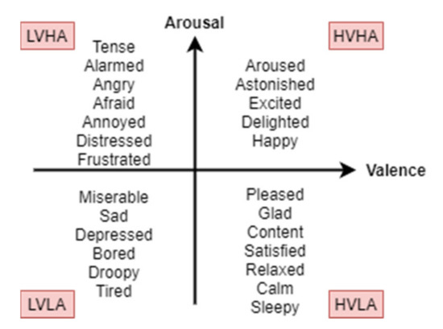

### Methodology
Process involves pre-processing of ECG signal, R peak detection, feature extraction, feature selection, classification and validation.

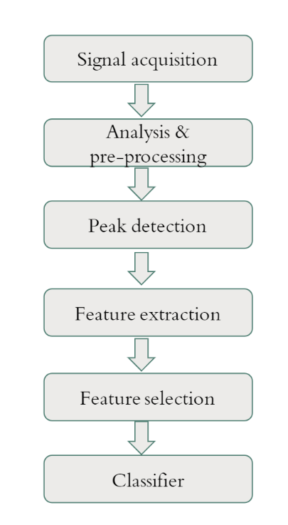

### Pre-processing
It is necessary to remove noises like baseline wander, powerline interferences etc before any further processing. 

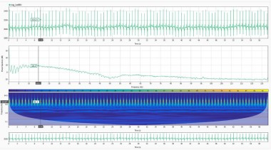

The above picture depicts the time domain signal, power spectral density (PSD) and scalogram of the last 60 seconds of ECG signal. From the above time domain signal, it is evident that magnitude is shifted by some amplitude. Thus, to eliminate the offset present in the signal, the average value of the signal must be subtracted from the original signal.

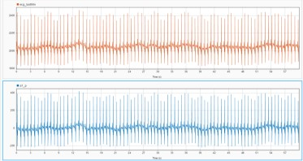

It is also evident that the offset removed signal has some low-frequency components (in the range of 0.5 Hz) to it. Thus, to detrend the signal, Savitzky Golay filtering with 3rd order polynomial is used.

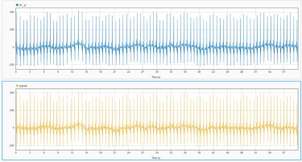

### R Peak Detection
To find R peaks in the signal, wavelet decompositon technique is used. The wavelet ‘sym4’ is utilised since it matches with our peak of interest. Four level decomposition decomposes the original signal into approximation and detailed coefficients.

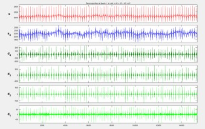

It is visible that the approximation coefficient 𝑎4 contains the lower frequency components and the detailed coefficients 𝑑2 and 𝑑1 contain the high frequency components. Inverse wavelet decomposition is taken with the detailed coefficients 𝑑4 and 𝑑3 which contain our frequency band of interest.

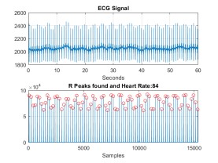

### Feature Extraction
The features can be extracted from the time domain, frequency domain and non-linear domain. Heart Rate (HR) is calculated by averaging the number of R peaks over a minute. The benefits of HR over other features are the simplicity of the calculation and not requiring a highly  accurate measurement. Even during an intensive exercise, the measurement of the HR is still reliable. Heart Rate Variation (HRV) measures specific changes between heart beats in the time domain. The time between beats is  measured in milliseconds (ms) and is called an RR interval or IBI. In this project, temporal, spectral and non-linear features are extracted. 

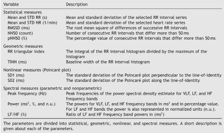

## Instructions 
- To extract features from the complete ECG dataset of DREAMER dataset, run 'ECG_emotion_detection.m' in matlab. The extracted stimuli and baseline features will be stored in the respective variables 'stimuli_features' and 'baseline_features' which are saved as 'Extracted_features414x17x2.mat' for training the neural network in the next stage.
- For testing, use 'test_code.m', it works the same but with a smaller DREAMER dataset 'ECG_sample_dataset.mat'
- The live script 'affective_dimensional_model.mlx' gives a walkthrough of the operations

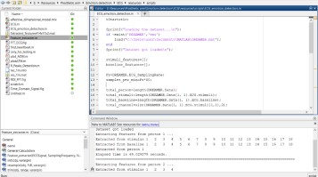

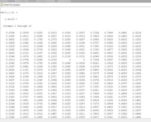

### Note
1) The class definition file 'Feature_extracter.m' should be in the same working directory.
2) The complete dataset can be downloaded from the following link https://zenodo.org/record/546113#.YS0TQFvhWV4
 
## Best ECG Datasets for emotion detection

- AMIGOS dataset: 
www.eecs.qmul.ac.uk/mmv/datasets/amigos/index.html, 
https://github.com/pokang-liu/AMIGOS

- DREAMER dataset:
https://zenodo.org/record/546113#.YS0TQFvhWV4

- AuBT:
https://www.informatik.uni-augsburg.de/de/aktuell/kolloquium/previous/ws07-08/2008-02-07kim/index.html

- ASCERTAIN:
https://ascertain-dataset.github.io/

## References 

- The presentation slide 'AI based Emotion Detection with ECG signal.pdf' gives more information on the flow
- Some of the reference articles can be found in the child directory
